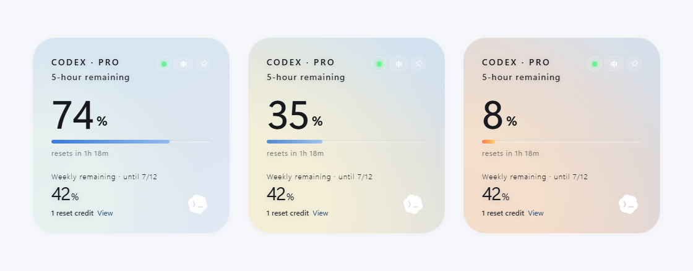
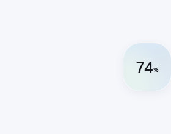
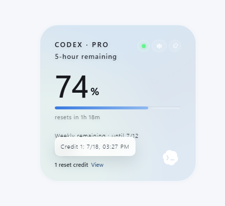

# QuotaLens for Codex

Personal floating desktop widget for checking Codex quota from the local Codex Desktop login state.



## Highlights

- Shows your Codex plan, weekly quota, next reset time, and reset credits in a compact always-on-top widget.
- Uses clear quota states for healthy, caution, and critical remaining usage.
- Collapses into a small floating orb when idle, then expands on hover.
- Indicates whether quota is currently being consumed.
- Includes quick controls for language switching and always-on-top behavior.
- Shows reset credit count and available reset-credit expiration times when the quota service provides them.
- Handles stale data, signed-out sessions, unavailable quota responses, and loading states without fabricating values.

## Screenshots

| Quota states | Floating orb | Reset credit expiration |
| --- | --- | --- |
|  |  |  |

## Repository Metadata

Suggested repository description:

```text
Floating Windows/macOS desktop widget for checking Codex quota from the local Codex Desktop login state.
```

Suggested topics:

```text
codex, quota, tauri, react, rust, desktop-app, windows, macos, productivity
```

## How It Works

QuotaLens for Codex reads the existing Codex Desktop login state on your machine and queries Codex/ChatGPT quota endpoints with that session. It does not estimate usage from local token counts and does not redeem reset credits or modify account settings.

Browser preview uses mock data. Real quota reading requires the Tauri desktop app and an existing Codex Desktop login on the same machine.

## Distribution

This is a personal build. If you publish installers from your own repository, use your own Releases page and keep unsigned-build warnings clear for Windows SmartScreen and macOS Gatekeeper.

## Privacy Boundary

QuotaLens for Codex is local-first and intentionally narrow:

- Reads the local Codex Desktop login state only to query Codex quota.
- Sends the existing Codex access token only to ChatGPT quota endpoints.
- Stores only widget preferences in its own app config directory.
- Does not store Codex tokens, account IDs, prompts, chat history, raw quota responses, or local auth paths.
- Does not include telemetry, analytics, crash reporting, or third-party tracking.
- Does not redeem reset credits or modify account settings.

See [PRIVACY.md](PRIVACY.md) and [SECURITY.md](SECURITY.md) for the full boundary.

## Accuracy Boundary

Codex quota is read from Codex/ChatGPT quota service responses. If the response format changes, the app shows an unavailable or stale state instead of inventing quota values.

## Development

Requirements:

- Node.js 20+
- Rust stable
- Tauri 2 system dependencies for your platform

```bash
npm install
npm run dev
npm run test
npm run build
npm run tauri dev
```

## Build

```bash
npm run tauri build
```

On Windows, Tauri may download WiX to create an MSI installer. If WiX download fails, the release executable may still be produced at:

```text
src-tauri/target/release/quotalens-codex.exe
```

## Release Hygiene

Do not upload local credentials, `.codex`, `.env*`, screenshots with personal data, `node_modules`, `dist`, `src-tauri/target`, or local installers to source control.

## Upstream

This project is based on `change-42-yhmm/quota-float`, used under the MIT License. Keep the original `LICENSE` notice when publishing your modified version.

## License

MIT

